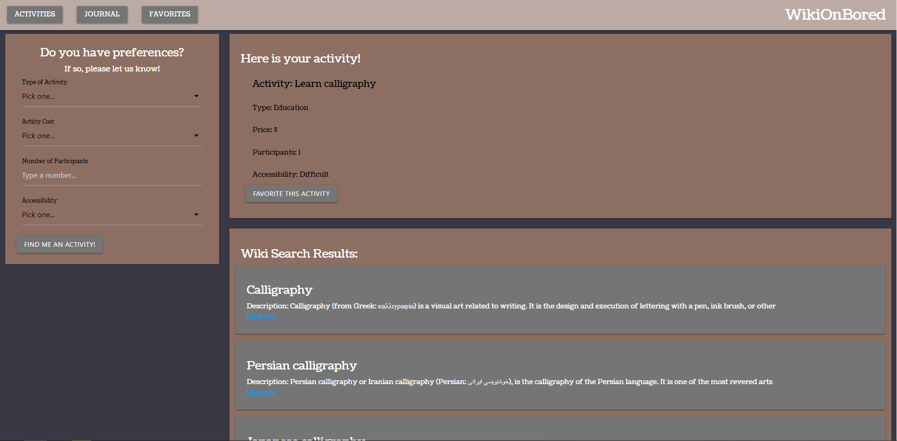

# WikiOnBored

>> AS A USER who is very bored and may or may not be ignorant about certain activities,
>> I WANT an activity randomly recommended for me, with or without parameters of my choosing, and relevant wikipedia definitions and links of said activity
>> SO THAT I will no longer be bored or ignorant!
>> WikiOnBored is a resource to help you find an activity when you are bored.
>> Upon entering WikiOnBored, it will ask you for your preferences (if you'd like) when searching for an activity to do and will then return with something you could do to end your boredom. 
>> We utilized the BoredAPI (https://www.boredapi.com/) to generate our activities.
>> Under your generated activity, information from articles on Wikipedia relating to your activity will display to give you more information if needed.
>> After doing your activity, you can head over to the "JOURNAL" page and log how your activity went. In the future, we'd like to allow users to post their experience and share with others.
>> You can add your activity to favorites with the button below your generated activity, which is saved to local storage and is accessible from the "FAVORITES" tab.
 
# Deployment

https://github.com/hseymo/Activity-Generator

# Content

# Summary

>> 

